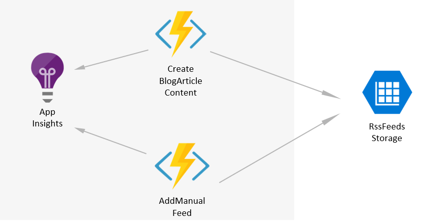

# MyMonthlyBlogArticle.Functions

This repository contains all the Azure Functions code and deployment setup related to this project: [My monthly "Azure News & Updates" blog article powered by Azure Logic Apps, Azure Functions and Azure Table Storage](https://alwaysupalwayson.blogspot.ca/2017/08/my-monthly-azure-news-updates-powered.html).



# Deploy

## Deploy via the Azure portal

[](https://portal.azure.com/#create/Microsoft.Template/uri/https%3A%2F%2Fraw.githubusercontent.com%2Fmathieu-benoit%2FMyMonthlyBlogArticle.Functions%2Fmaster%2Fazure-deploy.json)

## Deploy via CLI

```
RG=<your-existing-resource-group-name>
FunctionAppName=<function-app-name>
RssFeedsTableStorageConnectionString=<connection-string-of-the-azure-table-storage-containing-the-rss-feeds-table>

az group deployment create \
  -g $RG \
  --template-file azure-deploy.json \
  --parameters functionAppName=$FunctionAppName rssFeedsTableStorageConnectionString=$RssFeedsTableStorageConnectionString
```
