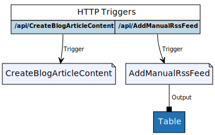

# MyMonthlyBlogArticle.Functions

This repository contains all the Azure Functions code and deployment setup related to this project: [My monthly "Azure News & Updates" blog article powered by Azure Logic Apps, Azure Functions and Azure Table Storage](https://alwaysupalwayson.blogspot.ca/2017/08/my-monthly-azure-news-updates-powered.html).

Image generated by https://functions-visualizer.azurewebsites.net.

# Deploy

